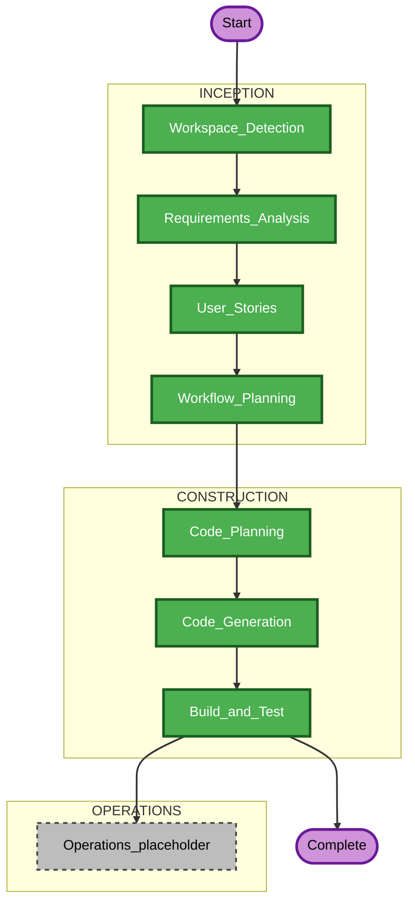

# Execution Plan — AI Bug Triage and Resolution Service

## Detailed Analysis Summary

### Project context
- **Project type**: Greenfield (no existing application code in workspace yet).
- **Transformation scope**: N/A (not brownfield).

### Change impact assessment
- **User-facing changes**: Yes — REST API, optional Streamlit dashboard, Jira comment drafts (human-reviewed).
- **Structural changes**: Yes — new layered service (API, services, integrations, agents, retrieval, persistence).
- **Data model changes**: Yes — SQLite tables for analyses and feedback; synthetic JSON datasets on disk.
- **API changes**: Yes — new public HTTP surface (health, webhooks, analyze, report, feedback).
- **NFR impact**: Yes — security baseline enabled; local-only constraints; logging and input validation required.

### Component relationships (logical)
- **API routers** depend on **services** (orchestration, retrieval, persistence).
- **Jira integration** depends on **settings** and **internal issue schema**.
- **Analysis** depends on **retrieval** + **normalized issue** + **Ollama client**.
- **Dashboard** depends on **backend API** only (last).

### Risk assessment
- **Risk level**: Medium (external Jira + LLM variability; mitigated by mocks, JSON repair, guardrails).
- **Rollback complexity**: Easy (local SQLite file + git).
- **Testing complexity**: Moderate (unit + API tests with mocks).

---

## Workflow visualization (AI-DLC phases)

### Mermaid (AI-DLC lifecycle decisions)

### Text alternative (AI-DLC)
- **Completed**: Workspace Detection, Requirements Analysis, User Stories, Workflow Planning (this document).
- **Skipped**: Reverse Engineering (no brownfield codebase).
- **Skipped (lean inception)**: Application Design, Units Generation — superseded by approved requirements, user stories, and `implementation-units-proposal.md` (avoids duplicate design artifacts).
- **Skipped (lean construction pre-code)**: Functional Design, NFR Requirements, NFR Design, Infrastructure Design as separate doc stages — security and NFRs are embedded in requirements and will be enforced during Code Generation + Build and Test.
- **Execute next**: Code Planning (per-unit) → Code Generation → Build and Test.

---

## Construction unit execution order (backend first, Streamlit last)

**Strict order**: Unit 1 → 2 → 3 → 4 → 5 → 6 → 7.

| Order | Unit | Focus | Maps to stories |
|:---:|:---|:---|:---|
| 1 | Foundation and API shell | FastAPI app, config, health, layout | US-B01–B03 |
| 2 | Synthetic data + retrieval | Seeded data, keyword retrieval | US-B04–B05 |
| 3 | Jira + normalization | Client live/mock, internal issue model | US-B06–B07 |
| 4 | Analysis pipeline | Ollama abstraction, JSON + repair, guardrails | US-B09–B11 |
| 5 | Persistence + REST | SQLite, webhooks, analyze, report, feedback | US-B08, B12–B13, opt B14 |
| 6 | Tests + docs | Pytest expansion, README, security notes | US-Q01–Q02 |
| 7 | Streamlit dashboard | UI last | US-D01–D02 |

**Parallelism note**: Unit 4 can use temporary normalized fixtures until Unit 3 lands; recommended still **sequential** for clarity unless schedule pressure.

---

## Unit-by-unit: files, tests, deferrals

### Unit 1 — Foundation and API shell
**Expected files (create/modify)**
- `requirements.txt` — pinned dependencies (FastAPI, Uvicorn, Pydantic v2, etc.).
- `.env.example` — documented keys, no secrets.
- `app/main.py` — FastAPI app factory / entry.
- `app/core/config.py` — `BaseSettings` or equivalent for env vars.
- `app/core/logging.py` — structured logging setup.
- `app/api/__init__.py`, `app/api/health.py` — `GET /health`.
- `app/__init__.py` and package `__init__.py` files as needed.
- `README.md` — stub pointer to full docs in Unit 6 (or minimal run line).

**Test scope**
- `tests/test_health.py` — health returns 200 and JSON shape; no secrets in response.

**Optional / defer**
- Middleware for request IDs (add in Unit 5/6 if not in Unit 1).

---

### Unit 2 — Synthetic data + retrieval
**Expected files**
- `data/historical_bugs.json`, `data/runbooks.json`, `data/configs.json`, `data/logs.json` — generated and committed.
- `scripts/generate_synthetic_data.py` (or `tools/`) — seeded generator.
- `app/services/dataset_loader.py` — load JSON into typed structures.
- `app/retrieval/keyword_retrieval.py` — scoring, top-N, explainability.
- `app/schemas/retrieval.py` — result types if helpful.

**Test scope**
- `tests/test_retrieval.py` — scoring, empty input, no matches, deterministic ordering with fixed seed data.

**Optional / defer**
- CSV export of datasets; extra metadata fields beyond requirements.

---

### Unit 3 — Jira integration and normalization
**Expected files**
- `app/integrations/jira_client.py` — REST calls; mock implementation or adapter.
- `app/schemas/jira.py` — raw webhook/API shapes (minimal fields).
- `app/schemas/issue.py` — normalized internal issue.
- `app/services/issue_normalizer.py` — map Jira → internal.
- `tests/fixtures/jira_webhook_sample.json`, `tests/fixtures/jira_issue_rest_sample.json`.

**Test scope**
- `tests/test_jira_client_mock.py` — mock path returns stable issue.
- `tests/test_normalize_issue.py` — webhook + REST fixtures → normalized model.

**Optional / defer**
- Rich Jira field coverage beyond MVP; attachment **content** download (metadata only per requirements).

---

### Unit 4 — Analysis pipeline (Ollama + JSON + guardrails)
**Expected files**
- `app/agents/model_client.py` — Ollama HTTP client abstraction (LangGraph-ready interface).
- `app/agents/orchestrator.py` — steps: build prompt, call model, validate/repair.
- `app/agents/prompts.py` — triage system/user prompts.
- `app/schemas/analysis.py` — Pydantic output schema (all required fields).
- `app/services/json_repair.py` — extract/repair JSON (small, testable functions).

**Test scope**
- `tests/test_analysis_schema.py` — valid JSON validates; invalid triggers repair path.
- `tests/test_guardrails_strings.py` — optional: assert forbidden phrases absent in template (lightweight).
- Mock model client for unit tests (no running Ollama required in CI).

**Optional / defer**
- LangGraph migration; multi-step agent graphs.

---

### Unit 5 — Persistence + core REST API
**Expected files**
- `app/db/session.py`, `app/db/base.py` — engine, session factory.
- `app/models/` — SQLAlchemy models (Analysis, Feedback).
- `app/services/analysis_store.py`, `app/services/feedback_store.py`.
- `app/api/webhooks.py` — `POST /webhooks/jira`.
- `app/api/issues.py` — `GET .../analyze`, `GET .../report`.
- `app/api/feedback.py` — `POST /feedback`.
- `app/services/triage_pipeline.py` — orchestrates normalize → retrieve → analyze → persist.

**Test scope**
- `tests/test_api_issues.py` — analyze/report/feedback with TestClient + mocks for Jira and model.
- `tests/test_persistence.py` — SQLite file or in-memory SQLite for stores.

**Optional / defer (US-B14)**
- `POST /jira/{issue_id}/comment-draft`
- `GET /search/similar?query=...`
- Async queue for webhooks (sync MVP acceptable if documented).

---

### Unit 6 — Tests and documentation hardening
**Expected files**
- `README.md` — full local setup: Python 3.11+, `uvicorn`, Ollama + `qwen2.5:7b`, Jira env, webhook tunnel notes.
- `docs/security-notes.md` or section in README — validation, logging, fail-closed errors, no secret logging.
- `pytest.ini` or `pyproject.toml` test config if needed.
- `tests/conftest.py` — shared fixtures.

**Test scope**
- Broaden integration tests; ensure `pytest` passes from clean checkout.
- Optional: `pip-audit` or `pip check` documented (supply chain note for SECURITY-10).

**Optional / defer**
- CI workflow YAML (GitHub Actions); Docker Compose for Ollama + app.

---

### Unit 7 — Streamlit dashboard (last)
**Expected files**
- `dashboard/streamlit_app.py` — list/detail; optional “analyze” action.
- `requirements.txt` — add `streamlit` (pin).

**Test scope**
- Light smoke: optional `tests/test_streamlit_import.py` or manual checklist in README (Streamlit e2e often manual for MVP).

**Optional / defer**
- Auth for dashboard; multi-page app; charts.

---

## Optional items deferred (cross-cutting)
- **US-B14** optional REST endpoints (comment-draft, similar search).
- **PostgreSQL** — document migration only.
- **Feedback-driven retrieval ranking** — post-MVP.
- **Vector DB / embeddings** — post-MVP.
- **LangGraph** — interface-ready only in MVP.
- **Jira write** beyond returning draft text — out of scope for automation.
- **Heavy inception docs** (Application Design, Units Generation as separate stages) — skipped; this plan + requirements + stories suffice.

---

## Success criteria (workflow / construction)
- Units 1–6 deliver a **runnable backend** with tests and README; Unit 7 adds UI **without** changing backend contracts.
- All previously approved constraints remain satisfied.
- **Code generation does not start** until you explicitly approve this execution plan (separate from story approval).

---

## Approval gate (before Code Generation)

**Status**: Awaiting your explicit approval of this execution plan to begin **Code Planning / Code Generation** per unit order above.

When you approve, next step is to implement Unit 1 with a short per-unit plan, then code, then summarize — without skipping the approval you requested for code generation start.
